## Отчет по лабораторной работе N 1

## Задание № 1

#Написать сервис, который будет раз в 30 секунд мониторить лог на предмет наличия ключевого слова. Файл и слово должны задаваться в /etc/sysconfig

# создать конфиг. файл 

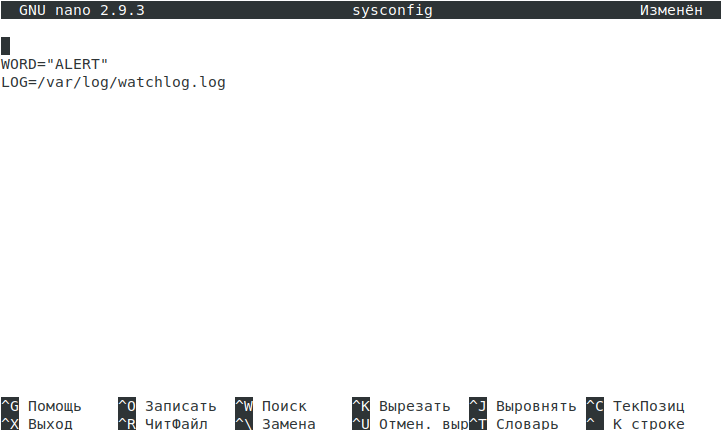

# Создаем файл /var/log/watchlog.log

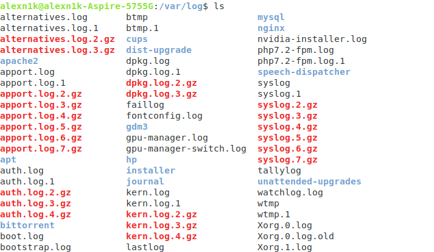

# Создадим скрипт

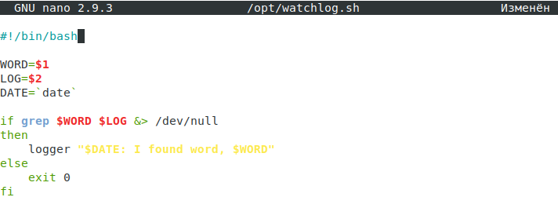

# Создадим юнит для сервиса

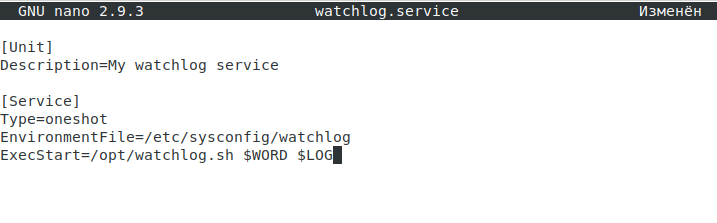

# Создадим юнит для таймера

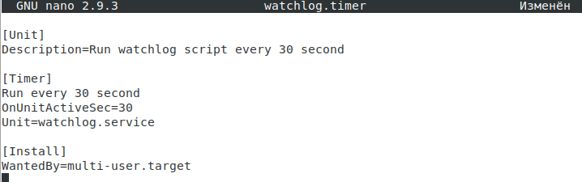

# Запустить и убедиться в результате

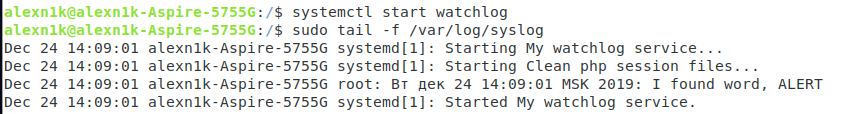

## Задание № 2

#  Из epel установить spawn-fcgi и переписать init-скрипт на unit-файл. Имя сервиса должно также называться

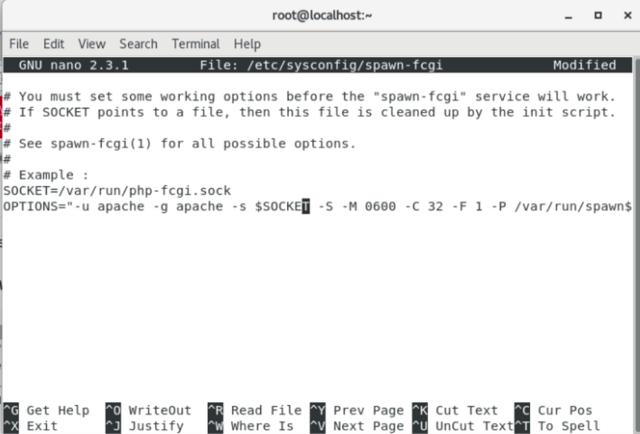

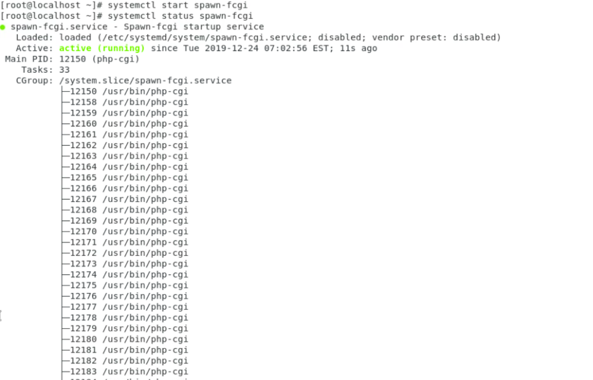

## Задание № 3

# Дополнить юнит-файл apache httpd возможностью запустить несколько инстансов сервера с разными конфигурациями

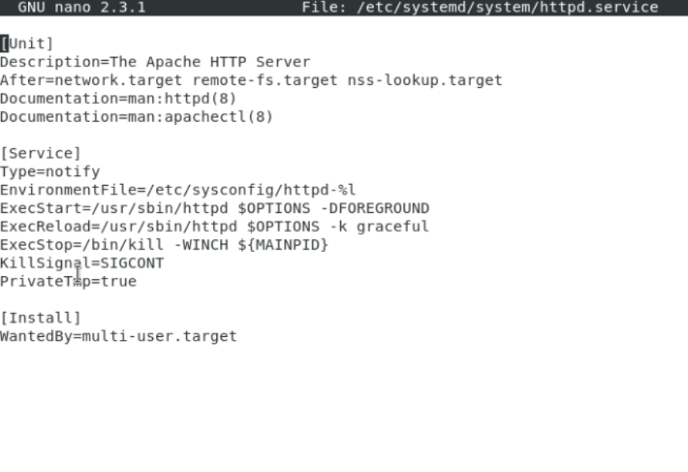

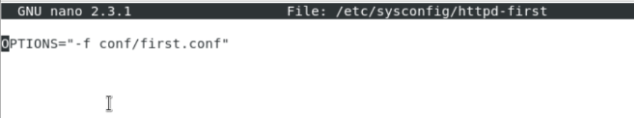
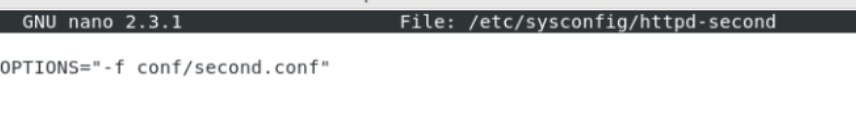
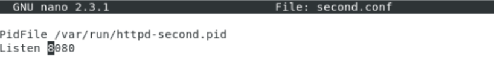

