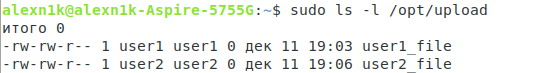

## Отчет по лабораторной работе N 2

## Создаем пользователей

```bash
man useradd
useradd -m -s /bin/bash user1
useradd -m -s /bin/bash user2 
```


* В результате у вас создадуться два пользователя
* Какие UID создались у пользователей?
  * 1001 для user1 и 1002 для user2
* Что означают опции -m и -s
  * -s - имя оболочки пользователя. В данном случае bash
  * -m - создать домашнюю директорию для пользователя по пути /bin/bash  
* Ответы приложить в README.md

---

## Создаем группу и добавляем туда пользователей

```bash
man groupadd
man gpasswd
groupadd admins
gpasswd -a user1 admins
gpasswd -a user2 admins
id user1
id user2
```


* Результаты команды id добавить в README.md
* (*) Через usermod сделайте группу admins основной для  user1. Результат id приложить в README.md

---

## Создать каталог от рута и дать права группе admins туда писать




```bash
mkdir /opt/upload
chmod 770 /opt/upload
chgrp admins /opt/upload
```
* что означают права 770 ?
  * Означают выдачу прав на запись, чтение и исполнение для владельцов файла и группы владельцов. Для остальных пользователей права не выданы
* создать по файлу от пользователей user1 и user2 в каталоге /opt/uploads
  * см. выше
* проверьте с какой группой создались файлы от каждого пользователя. Как думаете - почему?
  * user1 с группой admins, user2 - user2. Потому что для user1 мы сделали основной группой admins, а для user2 основной группой admins мы не назначали.
* (*) попробуйте сменить текущую группу пользователя  ```newgrp admins``` у пользователя user2 и создайте еще файл
* приложить ```ls -l /opt/upload```  в  README.md

---

## Создать пользователя user3 и дать ему права писать в /opt/uploads


* Создайте пользователя user3
* Попробуйте записать из под него файл в /opt/uploads. Должны получить ошибку
* Считайте acl с каталога. Добавьте черерз  setfacl права на запись в каталог.
```bash
man getfacl
man setfacl
getfacl /opt/upload
setfacl -m u:user3:rwx /opt/upload
su - user3
touch /opt/upload/user3_file
ls -l /opt/upload/user3_file
```
* приложить ```ls -l /opt/upload```  в  README.md
* приложить финишный acl  директории в README.md
---

## Установить GUID флаг на директорию /opt/uploads

_текущие версии Linux игнорируют установку SUID на диреторию, также игнорируется выставление SUID на shell скрипт_

```bash
chmod g+s /opt/upload
su - user3
touch /opt/upload/user3_file2
ls -l /opt/upload/user3_file2
```
* Приложить ```ls -l /opt/upload```  в  README.md
* Объяснить почему изменилась группа при создании
  * Команда chmod g+s . устанавливает идентификатор группы (setgid) в текущем каталоге, написанный как '.'. Это означает, что все новые файлы и подкаталоги, созданные в текущем каталоге, наследуют идентификатор группы в каталоге, а не основной идентификатор группы пользователя, создавшего файл. Это также будет передано в новые подкаталоги, созданные в текущем каталоге

---
## Установить  SUID  флаг на выполняемый файл

_текущие версии Linux игнорируют выставление SUID на shell скрипт (проеврка на shebang)_

* Установим suid бит на просмотрщик cat 
* В начале  попробуйте прочитать cat /etc/shadow  из под пользователя user3
* Установить suid /bin/cat и прочитайте снова из под user3
* В README.md добавьте оба результат
* Объясните почему

---
 
 
##  Сменить владельца  /opt/uploads  на user3 и добавить sticky bit
```bash
chown user3 /opt/upload
chmod +t /opt/upload
su - user1
touch /opt/upload/user1_file_test
ls -l /opt/upload/user1_file_test
su - user3
rm -f  /opt/upload/user1_file_test
```


* Объясните почему user3 смог удалить файл, который ему не принадлежит
  * Командой chown мы назначили владельцем папки пользователя user3 и все файлы в ней может удалить только он. Никто больше не имеет права этого делать. (Sticky Bit)
* Создайте теперь файл от user1 и удалите его пользователем user1
  * не получится, нет прав
* Объясните результат

---

## Записи в sudoers


* попробуйте из под user3 выполнить ```sudo ls -l /root```
* для редактирования sudoers используйте  visudo
* почему у вас не получилось?
  * user3 не был прописан в группу суперпользователя и поэтому не мог просматривать домашний каталог пользователя root, который находится в группе sudoers


