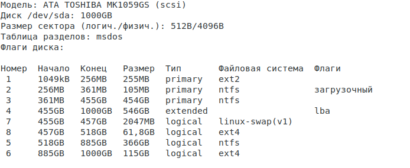

отчет по лабораторной работе № 3 

## lsblk 


## fdisk -l


## parted -l



* Какой размер дисков?
  * 931,5 GiB, 1000204886016 байт
* Есть ли неразмеченное место на дисках?
  * нет
* Какой размер партиций?
  * /dev/sda1                    2048     499711     497664       243M            83 Lin
/dev/sda2  *               499712     704511     204800   100M             7 HPF
/dev/sda3                  704512  887732223  887027712   423G             7 HPF
/dev/sda4               887734270 1953521663 1065787394 508,2G             f W95
/dev/sda5              1012424704 1728241663  715816960 341,3G             7 HPF
/dev/sda6              1728243712 1953521663  225277952 107,4G            83 Lin
/dev/sda7               887734272  891731967    3997696   1,9G            82 Lin
/dev/sda8               891734016 1012416511  120682496  57,6G            83 Lin
* Какая таблица партционирования используется?
  * msdos
* Какой диск, партция или лвм том смонтированы в /
  * /sda1 ...sda8

## Попробуем создать файлик в каталоге /dev/shm

## dd if=/dev/zero of=/dev/shm/mai bs=1M count=10


## free -h 


* Что такое tmpfs
  * Временное файловое хранилище для монтирования файловых систем, размещаемых в ОЗУ
* какая часть памяти изменялась?
  * Свободная

## Изучим процессы запущенные в системе


ps -eF


ps rx 


ps -e --forest


ps -efL


* Какие процессы в системе порождают дочерние процессы через fork
  * Все процессы кроме (init)
* Какие процессы в системе являются мультитредовыми
  * Несколько одинаковых процессов с одним pid но с разными lwp, имеют общую память и процессорное время, в отличие от форкнутых


## Разберитесь что делает команда

```bash
ps axo rss | tail -n +2|paste -sd+ | bc
```


* Что подсчитывается этой командой
  * ps axo rss показывает сколько памяти в КБ "ест" процесс. tail -n +2 показывает первые 2 строки. paste -sd+ дружит два файла с разделителями TAB. bc - утилита-калькулятор. В итоге команда дает число 6304220
* Почему цифра такая странная 
  * Потому что это сумма всех килобайт, потребляемых процессами

## Запустим приложеннный скрипт и понаблюдаем за процессами
```bash
python myfork.py
```


* в другом терминале  отследите порождение процессов


* отследите какие состояния вы видите у процессов


* почему появляются процессы со статусам Z
  * потому что дочерний процесс завершился раньше, чем родительский

* какой PID у основного процесса
  * 8051
* убейте основной процесс ```kill -9 <pid>```
  * Сделано)
* какой PPID стал у первого чайлда
  * 8052
* насколько вы разобрались в скрипте и втом что он делает?
  * Скрипт запускает основной процесс, потом запускает дочерний процесс. Если его PID - 0, то это дочерний процесс. Иначе же - это сам процесс.

## Научимся корректно завершать зомби процессы

* расскоментируем строки в скрипте
```python
      pid, status = os.waitpid(pid, 0)
      print("wait returned, pid = %d, status = %d" % (pid, status))
```
* поторим все еще раз
* отследим корректное завершение чайлда
  

## Научимся убивать зомби процессы
* запускаем процессс еще раз
```bash
gdb
> attach <parent_PID>
> call waitpid(zombie_PID, 0, 0) wait
> detach
> quit
```


## Решаем загадку исчезновения места на диске
* создадим директорию ~/myfiles
* запустим файл test_write.py из ранее созданной директории
* проверим в другом терминале что в этой директории создался файл и он увеличивается в размере


* в первом терминали нажмем Ctrl+Z
* проверим статус файла
* выполним команды
```bash
jobs -l
fg
```
* eще раз остановим  процесс черерз CTRL+Z
* выполним команду ```bg```
* проверим размер файловой системы и каталога
```bash
df 
du -sh  ~/myfiles
```
* удалим файл
* повторно проверим размеры кталога и файловой системы
* Какую систуацию вы видите, как вы это объясните
* Подключитесь к процессу через ```strace -p <pid>``` и назовите дескриптор файла, куда пишет процесс
* проверим какие файлы открыты у нашего процесса через команду lsof -p <pid>
* убьем процесс
* еще раз прорим размер файловой системы и каталога
  


* Напишите свое объяснение, что произошло
  * Завершися процесс, который писал в файл и был поставлен на паузу. Закрылся файловый дескриптор и теперь файл спокойно удалился.


## Утилиты наблюдения
* C помощью утилит мониторинга 
* проверьте текущий LA 

* запишите top 3 процессов загружающих CPU

* запишите top 3 процессов загружающих память 

* запустите утилиту atop как сервис через systemd
* запустите dd на генерацию файла размер в 3 гигабайта
  dd of=file bs=1 count=0 seek=3G
* удалите сгенеренный файл
* через atop скажите какой  pid был у процесса
* Проанализируйте нагрузку на диск через утилиты  iotop и iostat

